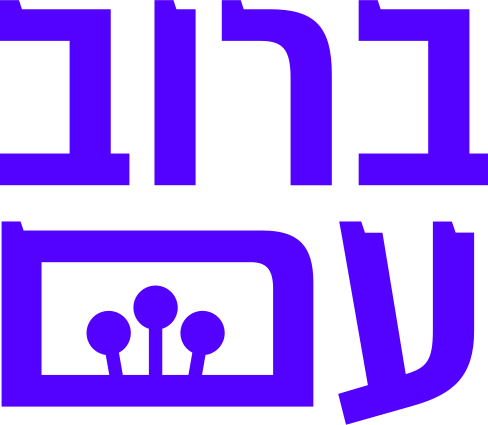

# אפליקציית **ברוב עם**

  

 

>תכנון אפליקצייה [← figma](https://www.figma.com/file/ZVR8LMlZ359l9Lg1MpouCu/planing?type=whiteboard&t=v2nRiir6UPkVz0Uy-1)  
>תכנון מסכים [← figma](https://www.figma.com/file/tSH3mW9se9HT9Zz0nJ4oJs/App-Screens?type=design&mode=design&t=1kAnJtjFotGIWbCe-1)

אפליקציית מציאת מניין המבוססת על חכמת ההמונים- כוח הרבים, ברוב עם!  
משתמש מציין מיקום- ובהתאסף מניין באזור נשלחת הודעה ונוצר מניין.  
האפליקציה מתאימה לשימוש במקומות יישוב, בהם יש בתי כנסיות ולשימוש בשטחים פתוחים, טיולים וכד’ בהם ניתן ליצור מניין באופן עצמאי.  
האפליקציה מתאימה ליצירת מניינים קבועים וחד פעמיים, בהתאם לצורך.

>למען הסדר הטוב במקומות בהם באו לידי ביטוי דרישות הפרויקט, הושם תו ♥  
חיפוש כללי אחריו ימקד את הבדיקה :)  
בהצלחה, ותודה על הכל!

כמובן, האפליקצייה רחוקה מלהיות מושלמת.  מקווה יום אחד לשדרג אותה....

Tech stack: React, JavaScript, CSS, MUI library.